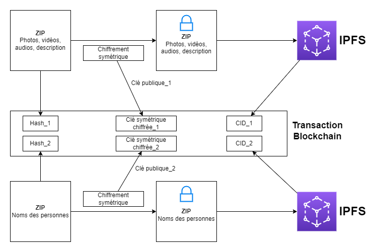

# 🕵️‍♀️ Corruption Reporting DApp

This repository contains the source code for a prototype of a decentralized application (DApp) developed as part of a Bachelor’s thesis. The DApp allows individuals to securely report acts of corruption or other illicit activities by uploading evidence and metadata, storing them on IPFS, and anchoring access records on the Ethereum blockchain. This work was submitted on **4 September 2023** as my Bachelor’s thesis and was awarded **“Most Innovative Bachelor Thesis”** prize by the **Economics & Services** domain.


## 📑 Table of Contents

1. [Application Architecture](#application-architecture)  
2. [Technologies Used](#technologies-used)  
   - [Front‑end](#front‑end)  
   - [Back‑end](#back‑end)  
3. [Installation & Setup](#installation--setup)  
4. [How It Works](#how-it-works)  
   1. [Upload & ZIP Creation](#1-upload--zip-creation)  
   2. [Hashing & Symmetric Encryption](#2-hashing--symmetric-encryption)  
   3. [Asymmetric Key Wrapping](#3-asymmetric-key-wrapping)  
   4. [IPFS Storage](#4-ipfs-storage)  
   5. [Ethereum Transaction](#5-ethereum-transaction)  
   6. [Decryption & Verification](#6-decryption--verification)  
5. [Directory Structure](#directory-structure)  
6. [License](#license)

---

## 🏛️ Application Architecture



1. **User Submission**  
   - Users enter names of suspects, victims, witnesses, etc.  
   - Upload media files (images, video, audio) and a text description.

2. **ZIP Packaging**  
   - Client‑side code bundles uploads into two ZIP archives:  
     - `evidence.zip` (media + description)  
     - `names.zip` (list of involved parties)  

3. **Hashing & Encryption**  
   - Compute SHA‑256 hash for each ZIP to ensure integrity.  
   - Generate a random 256‑bit AES key for each archive.  
   - Encrypt each ZIP symmetrically with its AES key.  

4. **Key Wrapping**  
   - Encrypt each AES key with its respective RSA public key.  
   - Two key pairs: one for evidence, one for names.

5. **IPFS Upload**  
   - Push both encrypted ZIPs to IPFS via Infura.  
   - Retrieve two distinct CIDs.

6. **Blockchain Anchoring**  
   - Construct an Ethereum transaction (Goerli testnet).  
   - Include: ZIP hashes, encrypted AES keys, two CIDs.  
   - Submit via Web3.js (Infura endpoint + MetaMask).

---

## 🛠️ Technologies Used

### Front‑end
- **Core**: HTML, CSS, JavaScript  
- **UI Framework**: Bootstrap  
- **Server**: Apache on XAMPP (serves static assets & client bundle)  

### Back‑end
- **Runtime**: Node.js 18.16.1 LTS (Windows 10)  
- **File I/O**: `fs` (built‑in Node.js module)  
- **ZIP Archiving**: `archiver`  
- **Hashing & Crypto**: `crypto` (built‑in Node.js module)  
- **Asymmetric Encryption**: RSA key‑pair (hybrid AES+RSA scheme)  
- **IPFS Client**: Infura API (via `ipfs-http-client`)  
- **Blockchain**: Web3.js, Goerli testnet, Infura provider  
- **Wallet**: MetaMask  

---

## 🛠️ Installation & Setup

**Clone repository**  

git clone https://github.com/SteBuilds/Corruption_Reporting_DApp.git


**Install Dependencies**

npm install


**Configure Environment**
- Create a .env in the project root:**

INFURA_PROJECT_ID=your_infura_id

ETH_RPC_URL=https://goerli.infura.io/v3/${INFURA_PROJECT_ID}

IPFS_API_URL=https://ipfs.infura.io:5001

CONTRACT_ADDRESS=0xYourContractAddress

**Generate RSA Key Pairs**
- On first run, the server will auto‑generate two RSA key pairs and store them under ./Clés RSA/**

node app.js

---

## 🔄 How It Works

### 1. Upload & ZIP Creation
- Users fill in names, description, and select media files.  
- Server uses `fs` + `archiver` to create:  
  - `evidence.zip`  
  - `names.zip`

### 2. Hashing & Symmetric Encryption
- Compute SHA‑256 hash of each ZIP (`crypto.createHash('sha256')`).  
- Generate two 256‑bit AES keys.  
- Encrypt ZIPs via AES‑256‑CBC; output files `*_encrypted.zip`.

### 3. Asymmetric Key Wrapping
- Encrypt each AES key with its RSA public key (`crypto.publicEncrypt`).  
- Produce `aes_key_*_encrypted.bin` for evidence & names.

### 4. IPFS Storage
- Upload encrypted ZIPs to IPFS via Infura’s HTTP API.  
- Obtain two CIDs (`evidenceCid`, `namesCid`).

### 5. Ethereum Transaction
- Connect to Goerli via Web3.js (+ Infura).  
- Construct and sign a transaction that stores:  
  - `evidenceHash`, `namesHash`  
  - `encryptedAesKeyEvidence`, `encryptedAesKeyNames`  
  - `evidenceCid`, `namesCid`  
- Submit using MetaMask → retrieve transaction hash.

### 6. Decryption & Verification
- Separate “decrypt” client asks for:  
  - Retrieved encrypted ZIP  
  - Corresponding AES‑key file  
  - RSA private key (`.pem`)  
  - Original hash from blockchain  
- Verifies SHA‑256 hash matches → decrypts AES key → decrypts ZIP → restores original files.

---

## 🗂 Directory Structure

## Application/
*Main application*

```
Application/
├── Clés RSA/                           # Auto‑generated RSA key pairs
│   ├── private_key1.pem
│   ├── private_key2.pem
│   ├── public_key1.pem
│   └── public_key2.pem
├── node_modules/
├── uploads/
├── addToIPFS.mjs
├── addToIPFSWithInfura.js
├── aes_key_evidence_encrypted.bin
├── aes_key_names_encrypted.bin
├── app.js
├── blockchainTransaction.js
├── evidence_cid
├── evidence_encrypted.zip
├── evidence_hash.txt
├── evidence.zip
├── names_cid
├── names_encrypted.zip
├── names_hash.txt
├── names.zip
├── package-lock.json
└── package.json
```

## ApplicationDecrypt/
*Second application used to decipher the content generated by the first to test that everything works*

```
ApplicationDecrypt/
├── Decrypted/
│   ├── images/
│   │   └── thumb-1920-563119.jpg
│   ├── decrypted_file.zip
│   └── description.txt
├── node_modules/
├── Uploads/
├── app.js
├── package-lock.json
└── package.json
```

---

## 🧾 License

This project is licensed under the MIT License. See LICENSE for details.

---
